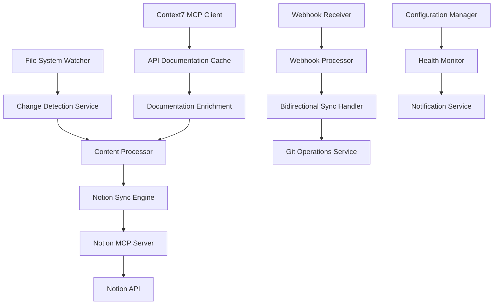

# Design Document

## Overview

The Documentation Sync System is a comprehensive solution that automatically synchronizes project documentation between the local file system and Notion workspace. The system replaces the existing broken Notion and Linear tools integration with a modern, reliable architecture using Context7 MCP for accessing up-to-date documentation and APIs.

The system operates as a Node.js service that monitors file changes, processes documentation content, and maintains bidirectional synchronization between the project repository and Notion databases. It leverages the official Notion MCP Server for reliable API interactions and implements robust error handling with retry mechanisms.

## Architecture

### High-Level Architecture



### System Components

1. **File System Monitor**: Watches for changes in documentation directories
2. **Content Processor**: Converts markdown to Notion blocks and handles metadata
3. **Notion Sync Engine**: Manages all Notion API operations via MCP Server
4. **Context7 Integration**: Fetches current API documentation for enrichment
5. **Webhook Handler**: Processes incoming Notion webhooks for bidirectional sync
6. **Health Monitor**: Tracks system status and sends notifications
7. **Configuration Manager**: Handles environment-specific settings

### Technology Stack

- **Runtime**: Node.js 18+
- **MCP Integration**: Official Notion MCP Server (@notionhq/notion-mcp-server)
- **Context7 Client**: For accessing up-to-date API documentation
- **File Watching**: chokidar for cross-platform file system monitoring
- **Markdown Processing**: unified/remark ecosystem for parsing and conversion
- **Git Operations**: simple-git for repository interactions
- **Configuration**: dotenv for environment management
- **Logging**: winston for structured logging
- **HTTP Server**: express for webhook endpoints

## Components and Interfaces

### Core Services

#### 1. DocumentationSyncService

```typescript
interface DocumentationSyncService {
  initialize(): Promise<void>
  startWatching(): void
  stopWatching(): void
  syncFile(filePath: string): Promise<SyncResult>
  syncDirectory(dirPath: string): Promise<SyncResult[]>
  getStatus(): ServiceStatus
}

interface SyncResult {
  success: boolean
  filePath: string
  notionPageId?: string
  error?: string
  timestamp: Date
}
```

#### 2. NotionMCPClient

```typescript
interface NotionMCPClient {
  connect(): Promise<void>
  disconnect(): Promise<void>
  createPage(properties: NotionPageProperties): Promise<string>
  updatePage(pageId: string, properties: NotionPageProperties): Promise<void>
  queryDatabase(databaseId: string, filter?: NotionFilter): Promise<NotionPage[]>
  createDatabase(parentId: string, schema: DatabaseSchema): Promise<string>
}

interface NotionPageProperties {
  title: string
  content: NotionBlock[]
  properties: Record<string, any>
  parent: { database_id: string } | { page_id: string }
}
```

#### 3. ContentProcessor

```typescript
interface ContentProcessor {
  parseMarkdown(content: string): ParsedDocument
  convertToNotionBlocks(document: ParsedDocument): NotionBlock[]
  extractMetadata(filePath: string, content: string): DocumentMetadata
  enrichWithApiDocs(content: string): Promise<string>
}

interface ParsedDocument {
  title: string
  content: string
  frontMatter: Record<string, any>
  headings: Heading[]
  codeBlocks: CodeBlock[]
  links: Link[]
}

interface DocumentMetadata {
  category: DocumentCategory
  lastModified: Date
  author?: string
  tags: string[]
  relatedFiles: string[]
}
```

#### 4. Context7Client

```typescript
interface Context7Client {
  resolveLibraryId(libraryName: string): Promise<string>
  getLibraryDocs(libraryId: string, topic?: string): Promise<LibraryDocs>
  cacheDocumentation(libraryId: string, docs: LibraryDocs): Promise<void>
  getCachedDocs(libraryId: string): Promise<LibraryDocs | null>
}

interface LibraryDocs {
  title: string
  description: string
  codeSnippets: CodeSnippet[]
  lastUpdated: Date
}
```

### Configuration Schema

```typescript
interface SyncConfiguration {
  notion: {
    mcpServerPath: string
    databaseIds: {
      documentation: string
      projects: string
      tasks: string
    }
    webhookSecret: string
  }
  
  monitoring: {
    watchPaths: string[]
    ignorePaths: string[]
    debounceMs: number
  }
  
  context7: {
    enabled: boolean
    cacheExpiryHours: number
    enrichmentEnabled: boolean
  }
  
  sync: {
    bidirectional: boolean
    retryAttempts: number
    retryDelayMs: number
    batchSize: number
  }
  
  notifications: {
    email?: EmailConfig
    slack?: SlackConfig
    webhook?: WebhookConfig
  }
}
```

## Data Models

### Document Mapping

```typescript
interface DocumentMapping {
  filePath: string
  notionPageId: string
  lastSyncHash: string
  lastSyncTime: Date
  syncDirection: 'file-to-notion' | 'notion-to-file' | 'bidirectional'
  conflictResolution: 'file-wins' | 'notion-wins' | 'manual'
}

interface SyncState {
  mappings: Map<string, DocumentMapping>
  lastFullSync: Date
  pendingOperations: SyncOperation[]
  errors: SyncError[]
}
```

### Notion Database Schema

#### Documentation Database
- **Title** (title): Document name
- **Category** (select): Architecture, Development, Mobile, API, Deployment, Planning
- **Status** (select): Draft, Review, Published, Outdated
- **File Path** (rich_text): Relative path in repository
- **Last Updated** (date): Last modification timestamp
- **Author** (people): Document author
- **GitHub Link** (url): Direct link to file in repository
- **Sync Status** (select): Synced, Pending, Error, Conflict
- **Content Hash** (rich_text): Hash for change detection
- **Tags** (multi_select): Categorization tags

#### Project Tasks Database
- **Task** (title): Task description
- **Status** (select): Not Started, In Progress, Completed, Blocked
- **Priority** (select): P0-Critical, P1-High, P2-Medium, P3-Low
- **Assignee** (people): Task owner
- **Due Date** (date): Target completion date
- **Related Docs** (relation): Links to documentation pages
- **GitHub Issue** (url): Link to GitHub issue
- **Linear Issue** (url): Link to Linear issue

## Error Handling

### Error Categories

1. **File System Errors**
   - File not found
   - Permission denied
   - File locked/in use
   - Invalid file format

2. **Notion API Errors**
   - Authentication failures
   - Rate limiting
   - Invalid page/database IDs
   - Malformed requests

3. **Context7 MCP Errors**
   - Service unavailable
   - Invalid library IDs
   - Documentation not found
   - Cache corruption

4. **Sync Conflicts**
   - Simultaneous modifications
   - Schema mismatches
   - Content format errors
   - Merge conflicts

### Error Handling Strategy

```typescript
interface ErrorHandler {
  handleFileSystemError(error: FileSystemError): Promise<void>
  handleNotionError(error: NotionError): Promise<void>
  handleSyncConflict(conflict: SyncConflict): Promise<ConflictResolution>
  retryOperation(operation: SyncOperation): Promise<boolean>
  escalateError(error: CriticalError): Promise<void>
}

interface RetryPolicy {
  maxAttempts: number
  backoffStrategy: 'exponential' | 'linear' | 'fixed'
  baseDelayMs: number
  maxDelayMs: number
  retryableErrors: ErrorType[]
}
```

## Testing Strategy

### Unit Testing

1. **Content Processor Tests**
   - Markdown parsing accuracy
   - Notion block conversion
   - Metadata extraction
   - API documentation enrichment

2. **Notion MCP Client Tests**
   - Connection management
   - CRUD operations
   - Error handling
   - Rate limiting compliance

3. **File System Monitor Tests**
   - Change detection accuracy
   - Debouncing behavior
   - Path filtering
   - Cross-platform compatibility

### Integration Testing

1. **End-to-End Sync Tests**
   - File creation → Notion page creation
   - File modification → Notion page update
   - File deletion → Notion page archival
   - Bidirectional sync scenarios

2. **Webhook Processing Tests**
   - Notion webhook validation
   - Payload processing
   - Conflict resolution
   - Error recovery

3. **Context7 Integration Tests**
   - Library resolution
   - Documentation retrieval
   - Caching behavior
   - Fallback mechanisms

### Performance Testing

1. **Load Testing**
   - Bulk file synchronization
   - Concurrent operations
   - Memory usage patterns
   - CPU utilization

2. **Stress Testing**
   - High-frequency file changes
   - Large file processing
   - Network interruptions
   - Resource exhaustion scenarios

### Test Environment Setup

```typescript
interface TestEnvironment {
  notion: {
    testWorkspaceId: string
    testDatabaseIds: Record<string, string>
    mockMCPServer: boolean
  }
  
  fileSystem: {
    testDirectory: string
    mockFiles: TestFile[]
    simulateErrors: boolean
  }
  
  context7: {
    mockResponses: boolean
    simulateLatency: boolean
    testLibraryIds: string[]
  }
}
```

## Security Considerations

### Authentication & Authorization

1. **Notion API Security**
   - Secure token storage in environment variables
   - Token rotation capabilities
   - Scope limitation to required permissions
   - Webhook signature verification

2. **Context7 MCP Security**
   - Secure connection establishment
   - Request authentication
   - Response validation
   - Rate limiting compliance

3. **File System Security**
   - Path traversal prevention
   - File permission validation
   - Symlink attack prevention
   - Sandboxed operations

### Data Protection

1. **Sensitive Information Handling**
   - PII detection and masking
   - API key redaction
   - Secure logging practices
   - Data encryption at rest

2. **Network Security**
   - HTTPS enforcement
   - Certificate validation
   - Request/response sanitization
   - Timeout configurations

## Deployment Architecture

### Development Environment

```yaml
services:
  doc-sync:
    build: .
    environment:
      - NODE_ENV=development
      - NOTION_MCP_SERVER=npx @notionhq/notion-mcp-server
      - CONTEXT7_ENABLED=true
    volumes:
      - ./docs:/app/docs:ro
      - ./logs:/app/logs
    ports:
      - "3000:3000"
```

### Production Environment

```yaml
services:
  doc-sync:
    image: evc/doc-sync:latest
    environment:
      - NODE_ENV=production
      - NOTION_MCP_SERVER=docker run --rm -i mcp/notion
    volumes:
      - /var/log/doc-sync:/app/logs
    restart: unless-stopped
    healthcheck:
      test: ["CMD", "curl", "-f", "http://localhost:3000/health"]
      interval: 30s
      timeout: 10s
      retries: 3
```

### Monitoring & Observability

1. **Health Checks**
   - Service availability
   - MCP server connectivity
   - File system accessibility
   - Database connectivity

2. **Metrics Collection**
   - Sync operation counts
   - Error rates
   - Processing latency
   - Resource utilization

3. **Alerting**
   - Critical error notifications
   - Performance degradation alerts
   - Sync failure notifications
   - System resource alerts

## Performance Optimization

### Caching Strategy

1. **Context7 Documentation Cache**
   - 24-hour TTL for API documentation
   - LRU eviction policy
   - Persistent storage for offline access
   - Background refresh mechanism

2. **Notion Content Cache**
   - Page content hashing for change detection
   - Metadata caching for quick lookups
   - Database schema caching
   - Query result caching

### Batch Processing

1. **File Change Batching**
   - Debounced change detection
   - Bulk API operations
   - Transaction-like processing
   - Rollback capabilities

2. **Rate Limiting Compliance**
   - Notion API rate limit adherence
   - Request queuing and throttling
   - Exponential backoff implementation
   - Priority-based processing

## Migration Strategy

### From Existing Tools

1. **Data Migration**
   - Export existing Notion databases
   - Map current file structures
   - Preserve historical sync data
   - Validate data integrity

2. **Configuration Migration**
   - Convert existing configurations
   - Update environment variables
   - Migrate webhook endpoints
   - Test connectivity

3. **Rollback Plan**
   - Backup current system state
   - Document rollback procedures
   - Test rollback scenarios
   - Monitor post-migration performance