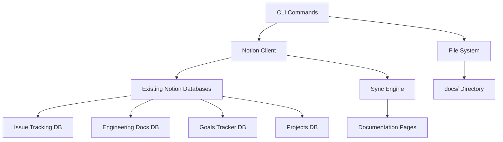

# Design Document

## Overview

The Notion Integration System will be a simple, focused solution that provides documentation synchronization and project data management with existing Notion databases. The system will be built as a lightweight CLI tool within the existing tools directory, leveraging the Notion API to work directly with the 4 pre-configured databases: Issue Tracking, Engineering Docs, Goals Tracker, and Projects.

## Architecture

### High-Level Architecture



### Service Architecture

The system will follow a simple, direct approach:

1. **CLI Layer**: Simple commands for sync and management
2. **Notion Client**: Direct API communication with existing databases
3. **File System Integration**: Read documentation files and project data
4. **Sync Logic**: Convert and update Notion pages with local content

## Components and Interfaces

### Core Components

#### 1. Simple NotionClient
```typescript
interface NotionClient {
  // Connection management
  testConnection(): Promise<boolean>;
  
  // Database operations
  queryDatabase(databaseId: string): Promise<Page[]>;
  
  // Page operations
  createPage(databaseId: string, properties: PageProperties): Promise<string>;
  updatePage(pageId: string, properties: PageProperties): Promise<void>;
}
```

#### 2. DocumentationSync
```typescript
interface DocumentationSync {
  // Sync documentation files to Notion
  syncDocsToNotion(): Promise<SyncResult>;
  convertMarkdownToNotionBlocks(content: string): NotionBlock[];
}
```

#### 3. SimpleConfig
```typescript
interface SimpleConfig {
  // Basic configuration management
  loadConfig(): NotionConfig;
  saveConfig(config: NotionConfig): void;
  validateApiKey(apiKey: string): Promise<boolean>;
}
```

### Data Models

#### NotionConfig
```typescript
interface NotionConfig {
  apiKey: string;
  databases: {
    issueTracking: '21c0c129-40cf-8066-967a-d82ad57cfe5f';
    engineeringDocs: '2180c129-40cf-8068-920d-c37c7f4a1ee0';
    goalsTracker: '2180c129-40cf-80c0-b957-d70bdc1357ce';
    projects: '2180c129-40cf-80c6-9431-e89a1ea27890';
  };
  sync: {
    documentationPath: 'docs/';
  };
}
```

#### DatabaseTemplate
```typescript
interface DatabaseTemplate {
  name: string;
  description: string;
  properties: Record<string, PropertyDefinition>;
  views: ViewDefinition[];
  initialData?: PageData[];
}
```

## Data Models

### Database Schemas

#### Issue Tracking Database
- **Title**: Issue title (Title)
- **Status**: Current status (Select: Open, In Progress, Review, Closed)
- **Priority**: Issue priority (Select: P0-Critical, P1-High, P2-Medium, P3-Low)
- **Assignee**: Responsible person (Person)
- **Labels**: Issue categories (Multi-select)
- **GitHub Issue**: Link to GitHub issue (URL)
- **Created Date**: Issue creation date (Date)
- **Due Date**: Target completion date (Date)
- **Repository**: Related repository (Select)

#### Engineering Docs Database
- **Document**: Document title (Title)
- **Category**: Document type (Select: Architecture, API, Mobile, Deployment, Planning)
- **Status**: Document status (Select: Draft, Review, Published, Outdated)
- **File Path**: Source file location (Rich Text)
- **Last Updated**: Last modification date (Date)
- **Author**: Document author (Person)
- **GitHub Link**: Link to source file (URL)
- **Tags**: Document tags (Multi-select)

#### Goals Tracker Database
- **Goal name**: Goal description (Title)
- **Status**: Goal status (Status: Not Started, In Progress, At Risk, Completed)
- **Priority**: Goal priority (Select: P0-Critical, P1-High, P2-Medium, P3-Low)
- **Team**: Goal category/team (Multi-select: Quality, Performance, Development)

#### Projects Database
- **Project**: Project name (Title)
- **Status**: Project status (Select: Planning, Active, On Hold, Completed)
- **Priority**: Project priority (Select: P0-Critical, P1-High, P2-Medium, P3-Low)
- **Team**: Assigned team members (Multi-select)
- **Start Date**: Project start date (Date)
- **End Date**: Project end date (Date)
- **Repository**: Related repositories (Multi-select)
- **Progress**: Project completion percentage (Number)

## Error Handling

### Error Categories

1. **Connection Errors**: API connectivity issues, authentication failures
2. **Rate Limiting**: API quota exceeded, request throttling
3. **Data Validation**: Invalid data formats, schema mismatches
4. **Sync Conflicts**: Concurrent modifications, merge conflicts
5. **Configuration Errors**: Invalid settings, missing required fields

### Error Handling Strategy

```typescript
class NotionIntegrationError extends Error {
  constructor(
    message: string,
    public code: string,
    public category: ErrorCategory,
    public retryable: boolean = false
  ) {
    super(message);
  }
}

interface ErrorHandler {
  handleError(error: NotionIntegrationError): Promise<void>;
  retryOperation<T>(operation: () => Promise<T>, maxRetries: number): Promise<T>;
  logError(error: Error, context: string): void;
}
```

### Retry Logic

- **Exponential Backoff**: For rate limiting and temporary failures
- **Circuit Breaker**: To prevent cascading failures
- **Dead Letter Queue**: For failed operations that need manual intervention

## Testing Strategy

### Unit Testing

- **Component Testing**: Individual service and utility functions
- **Mock Testing**: API interactions with mock responses
- **Configuration Testing**: Validation and error handling
- **Data Transformation Testing**: Sync operations and data mapping

### Integration Testing

- **API Integration**: Real Notion API interactions (with test workspace)
- **File System Integration**: Documentation sync operations
- **Database Integration**: Local cache and persistence
- **End-to-End Workflows**: Complete sync and management operations

### Test Structure

```typescript
describe('NotionClient', () => {
  describe('connection management', () => {
    it('should connect with valid API key');
    it('should reject invalid API key');
    it('should handle connection timeouts');
  });
  
  describe('database operations', () => {
    it('should create database with proper schema');
    it('should handle schema validation errors');
    it('should update existing databases');
  });
});
```

### Testing Tools

- **Jest**: Unit and integration testing framework
- **Supertest**: API endpoint testing
- **Mock Service Worker**: API mocking for tests
- **Test Containers**: Isolated test environments

## Performance Considerations

### API Rate Limiting

- **Request Queuing**: Batch operations to stay within limits
- **Caching Strategy**: Local cache for frequently accessed data
- **Incremental Sync**: Only sync changed data to minimize API calls

### Data Optimization

- **Lazy Loading**: Load data on demand
- **Pagination**: Handle large datasets efficiently
- **Compression**: Compress cached data to reduce storage

### Monitoring

- **Performance Metrics**: Track API response times and success rates
- **Usage Analytics**: Monitor feature usage and optimization opportunities
- **Health Checks**: Regular system health validation

## Security Considerations

### API Key Management

- **Encryption**: Store API keys encrypted at rest
- **Environment Variables**: Support for secure configuration
- **Key Rotation**: Support for updating API keys without downtime

### Data Protection

- **Input Validation**: Sanitize all user inputs
- **Output Encoding**: Prevent injection attacks
- **Access Control**: Validate permissions before operations

### Audit Logging

- **Operation Logging**: Log all API operations with timestamps
- **Error Logging**: Detailed error logs for troubleshooting
- **Access Logging**: Track who performs what operations